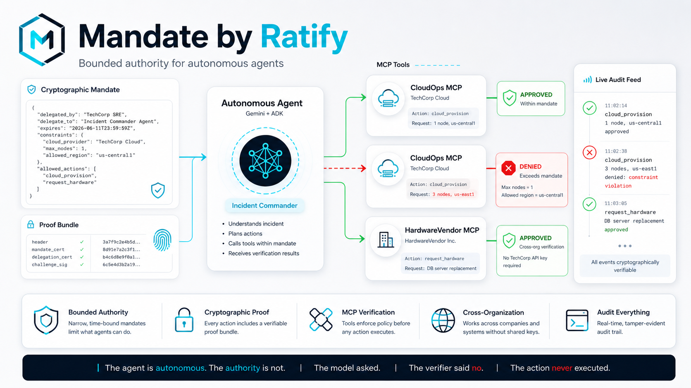

# Mandate — Bounded Authority for Autonomous Agents

> **"One mandate. Two worlds. Verified offline."**



Mandate is a Google AI Agents Challenge demo: a Gemini-powered incident-response agent acts through MCP tools, but every high-impact action must carry a cryptographic Ratify mandate. When the agent exceeds its mandate, the MCP server blocks the action before execution.

Ratify is the authorization layer. Mandate is the agent demo. The dashboard is branded **Ratify Verify** because it shows the live verification/audit feed for Mandate's actions.

The primary hackathon path uses Google ADK and requires `GOOGLE_API_KEY`. Smoke mode exists only as a developer test harness for the Ratify/MCP verifier path.

## What This Demo Proves

Mandate shows the control plane that autonomous agents need before they can safely operate production systems:

- The agent can plan and call tools autonomously through Gemini ADK and MCP.
- Every tool call carries a short-lived Ratify proof bundle.
- The receiving MCP server verifies the mandate before doing the work.
- Safe actions are approved; out-of-scope actions are denied before execution.
- A separate vendor can verify the same proof pattern without sharing TechCorp credentials or calling back to the issuer.

Core message:

> The agent is autonomous. The authority is not.
> The model asked. The verifier said no.
> The action never executed.

**Hackathon entry:** Google AI Agents Challenge 2026

---

## The Demo Story

1. **Incident fires** — SRE delegates authority to an AI commander
2. **Agent provisions** — approved (within mandate)
3. **Agent over-provisions** — ❌ **DENIED** by constraint enforcement (not the model)
4. **Cross-org vendor** — hardware ordered from HardwareVendor Inc., verified offline
5. **Physical world** — same bundle unlocks the rack door on a Raspberry Pi

---

## Architecture

```
                         ┌──────────────────────────────┐
                         │ TechCorp SRE (human issuer)  │
                         │ signs narrow Ratify mandate  │
                         │ max 1 node · us-central1     │
                         └──────────────┬───────────────┘
                                        │ SRE -> Commander delegation
                                        ▼
┌────────────────────────────────────────────────────────────────────┐
│ Mandate Agent                                                       │
│ Gemini + Google ADK incident commander                             │
│ - reads simulated production incident                               │
│ - issues short-lived specialist mandates                            │
│ - calls MCP tools with Ratify proof bundles                         │
└───────────────┬───────────────────────────────────────┬────────────┘
                │                                       │
                │ cloud_provision(...)                  │ request_hardware(...)
                ▼                                       ▼
┌──────────────────────────────┐        ┌──────────────────────────────┐
│ CloudOps MCP                  │        │ HardwareVendor MCP            │
│ Org A: TechCorp               │        │ Org B: outside vendor         │
│ port 8090                     │        │ port 8091                     │
│                               │        │                              │
│ ratify.Verify(...)            │        │ ratify.Verify(...)            │
│ + constraint enforcement      │        │ + cross-org verification      │
│                               │        │                              │
│ ✓ approve 1 node/us-central1  │        │ ✓ approve hardware request    │
│ ✕ deny 3 nodes/us-east1       │        │   no TechCorp API key needed  │
└───────────────┬──────────────┘        └───────────────┬──────────────┘
                │ verification events                    │ verification events
                └───────────────────────┬────────────────┘
                                        ▼
                         ┌──────────────────────────────┐
                         │ Event Relay                  │
                         │ Server-Sent Events · 8099    │
                         └──────────────┬───────────────┘
                                        ▼
                         ┌──────────────────────────────┐
                         │ Mandate Dashboard            │
                         │ http://localhost:8010        │
                         │ live approve/deny/audit feed │
                         └──────────────────────────────┘

Optional physical path:

                         ┌──────────────────────────────┐
                         │ Raspberry Pi / edge verifier │
                         │ Ratify C SDK · offline       │
                         │ same proof pattern           │
                         └──────────────────────────────┘
```

## What Each Piece Does

| Piece | Runs where | What it does |
|---|---|---|
| `agent/main.py` | Docker agent container | Gemini ADK incident commander. Calls MCP tools. Requires `GOOGLE_API_KEY`. |
| `agent/smoke.py` | Docker agent container | Developer test harness for approve, deny, and cross-org verification. |
| `mcp-server/` | Docker service on `8090` | CloudOps MCP tool. Verifies the mandate, approves one safe provision, denies out-of-bounds provision. |
| `vendor-mcp-server/` | Docker service on `8091` | HardwareVendor MCP tool. Verifies a mandate from another org boundary. |
| `events/` | Docker service on `8099` | Receives verification events from MCP servers and streams them to the browser. |
| `dashboard/index.html` | Docker service on `8010` | Static browser dashboard. It does not decide anything; it visualizes verifier decisions. |

---

## Prerequisites

For the self-contained demo path:

```bash
Docker
```

The demo requires a Gemini key:

```bash
export GOOGLE_API_KEY=your-gemini-api-key
```

If you do not set it first, `bootstrap-demo.sh` prompts for it. Create or view a Gemini API key at:

```text
https://aistudio.google.com/app/apikey
```

Google's Gemini API docs recommend using environment variables named `GEMINI_API_KEY` or `GOOGLE_API_KEY`; this demo uses `GOOGLE_API_KEY`, and the bootstrap script also accepts `GEMINI_API_KEY`.

If Docker is unavailable, `bootstrap-demo.sh` falls back to local Go/Python. On macOS it prompts to install missing Go/Python runtime dependencies with Homebrew.

---

## Quick Start

```bash
# Run the full Gemini ADK demo
./bootstrap-demo.sh --gemini

# Stop all services
./bootstrap-demo.sh --stop
```

Open **http://localhost:8010** in your browser before running the agent.

If Docker is running, the launcher uses Docker Compose. If Docker is unavailable, it automatically runs local Go services and a Python virtualenv instead.

For deterministic verifier testing without Gemini:

```bash
./bootstrap-demo.sh --smoke --yes
```

The smoke path is a developer harness. It is useful for CI, recording, and quick verification, but the primary demo path is Gemini ADK.

---

## Developer Test Harness

The hackathon demo uses Google ADK in `agent/main.py`. `--smoke` is not the submission path; it is a local test harness for the production control plane.

The smoke path runs `agent/smoke.py`, a deterministic driver for the same authorization sequence:

1. Issue specialist mandates with the Ratify Python SDK.
2. Call CloudOps MCP for an in-bounds provision.
3. Call CloudOps MCP for an out-of-bounds provision.
4. Call HardwareVendor MCP for cross-org verification.

It skips only the model planning step. The MCP servers, proof bundles, Ratify verification, denial logic, event relay, and dashboard are the same surfaces used by the Gemini path.

The Gemini path runs `agent/main.py`, which imports Google ADK and lets the model execute the incident plan through ADK function tools.

Expected smoke output:

```text
[PASS] cloud provision within mandate: approved
[PASS] cloud over-provision denied: constraint_denied
[PASS] hardware vendor cross-org approval: approved

MANDATE SMOKE DEMO PASSED
```

## Where Ratify SDKs Are Used

| Component | SDK usage |
|---|---|
| `agent/setup.py` | Uses the Ratify Python SDK to generate the SRE root identity, Commander agent identity, and SRE → Commander delegation. |
| `agent/mandate_common.py` | Uses the Ratify Python SDK to issue Commander → Specialist sub-mandates and sign fresh challenges. |
| `mcp-server/main.go` | Uses the Ratify Go SDK and calls `ratify.Verify(...)` before cloud actions execute. |
| `vendor-mcp-server/main.go` | Uses the Ratify Go SDK and calls `ratify.Verify(...)` before vendor actions execute. |
| `pi/verifier.c` | Optional physical/offline verifier path using the C SDK. |

---

## What to Watch For

| Moment | What happens | Why it matters |
|--------|-------------|----------------|
| Green row in dashboard | Agent provision approved | Mandate is working |
| **Red flash overlay** | Agent DENIED by constraint | Verifier enforced it, not the model |
| Cross-org badge | Hardware vendor verified independently | No TechCorp API key or issuer callback |
| Pi terminal (optional) | "Verification result: AUTHORIZED" | Same bundle, offline, no network |

---

## Physical Verifier (Raspberry Pi / Local)

```bash
cd pi

# macOS/Linux (no GPIO)
BUNDLE_FILE=../agent/keys/commander_bundle.json NO_GPIO=1 ./verifier

# Raspberry Pi (with GPIO LED on pins 18/23)
BUNDLE_FILE=../agent/keys/commander_bundle.json ./verifier
```

To rebuild:
```bash
SDK_DIR=/path/to/ratify-protocol/sdks/c make
```

---

## How This Maps to Ratify

Mandate is a companion demo for the open-source Ratify Protocol from Identities AI. The same proof pattern can be used by MCP servers, gateways, internal tools, and physical devices:

- **Open protocol**: identity, delegation, challenge signatures, proof bundles, and verifier SDKs.
- **Operational verifier**: the MCP server checks authorization before actions execute.
- **Audit surface**: every approval and denial is visible in the dashboard as a verifier decision, not a model preference.

---

## Files

| File | Purpose |
|------|---------|
| `agent/Dockerfile` | Self-contained Python agent runner for smoke and Gemini paths |
| `agent/main.py` | Gemini ADK incident commander with MCP tools |
| `agent/smoke.py` | Deterministic verifier harness: approve, deny, cross-org approve |
| `agent/setup.py` | Key generation and bundle creation |
| `mcp-server/` | CloudOps MCP — crypto verification + constraint enforcement |
| `vendor-mcp-server/` | HardwareVendor MCP — cross-org offline verification |
| `events/` | Event relay for dashboard live updates |
| `dashboard/index.html` | Live authorization feed with denial flash |
| `pi/verifier.c` | C physical verifier (Raspberry Pi GPIO) |
| `bootstrap-demo.sh` | One-command launcher for Docker, local fallback, Gemini mode, smoke mode, and shutdown |

---

## Note on Bundle Freshness

The commander bundle generated by `agent/setup.py` is valid for 24 hours. The agent signs fresh specialist challenges at runtime. If you see expiry failures, re-run `python3 agent/setup.py` before starting the demo.

---

## Future Demo Directions

- Mandate issuance from the Ratify web console.
- Additional MCP reference servers for common SaaS and infrastructure actions.
- Physical AI examples where the same proof bundle authorizes local/offline devices.
